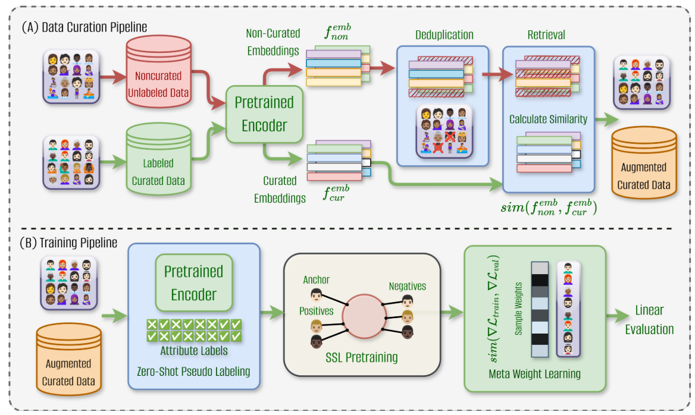

# A Self-Supervised Learning Pipeline for Demographically Fair Facial Attribute Classification


Repository contains code to curate dataset given unlabeled dataset.
- [Research Paper]()

Version 1.0 (07.01.2024)

## Table of Contents

- [Abstract](#abstract)
- [Database Properties](#database-properties)
- [Download](#download)
- [Citing](#citing)
- [Acknowledgment](#acknowledgment)
- [License](#license)


## Abstract
Published research highlights the presence of demographic bias in automated facial attribute classification.
Proposed bias mitigation techniques are mostly based on
supervised learning, which requires a large amount of
labeled training data for generalizability and scalability.
However, labeled data is limited, requires laborious annotation, poses privacy risks, and can perpetuate human
bias. In contrast, self-supervised learning (SSL) capitalizes on freely available unlabeled data, rendering trained
models more scalable and generalizable. However, these
label-free SSL models may also introduce biases by sampling false negative pairs, especially at low-data regimes
(< 200K images) under low compute settings. Further,
SSL-based models may suffer from performance degradation due to a lack of quality assurance of the unlabeled data
sourced from the web. This paper proposes a fully selfsupervised pipeline for demographically fair facial attribute
classifiers. Leveraging completely unlabeled data pseudolabeled via pre-trained encoders, diverse data curation
techniques, and meta-learning-based weighted contrastive
learning, our method significantly outperforms existing SSL
approaches proposed for downstream image classification
tasks. Extensive evaluations on the FairFace and CelebA
datasets demonstrate the efficacy of our pipeline in obtaining fair performance over existing baselines. Thus, setting
a new benchmark for SSL in the fairness of facial attribute
classification
For more details, please take a look at the [Research Paper]().

# Data Curation Pipeline for Facial Attribute Classification

This repository outlines a data curation pipeline designed for training self-supervised models on compact datasets. The approach focuses on ensuring exceptional quality, diversity, and balance in the training data, even in low-compute settings. Below are the detailed steps of the data curation process.

## Data Curation Pipeline


### 1. Data Sources
- Gather a large collection of unlabeled datasets to cover a wide variety of face images.
- Primary sources include: (You need to download these unlabeled datasets, process it appropriately and place in the respective input directories).
  - **LAION Face Dataset** (randomly sampled subset) [link]()
  - **BUPT Face Dataset** (randomly sampled subset) [link]()
- These datasets offer a wealth of images (∼ 50M) but lack sp ecific facial attribute labels needed for downstream tasks.
- Use **FairFace** dataset (∼ 100K) [link]() for its balanced distribution and manual annotation.

### 2. Image Embedding Generation
- Process both the noncurated collection and FairFace dataset (retrieval set) through a pretrained ViT-L/16 vision encoder of the CLIP model.
- This step produces image embeddings, which are numerical representations capturing the essence of each image.

### 3. Deduplication and Retrieval
- Use generated embeddings for data filtering:
  - **Deduplication**: Run a deduplication step on the noncurated dataset using cosine similarity on image embeddings to identify and remove duplicates.
  - **Similarity Search**: Perform a similarity search to retrieve images that match the good-quality, diverse examples in the FairFace dataset.
  - For each image in the retrieval set, retrieve M similar embeddings from the noncurated set (M < 5 found to be sufficient).
- Employ **Faiss** package from Meta for efficient KNN search with GPU acceleration.

### 4. Image Quality Filtering (Optional)
- Use a non-reference-based facial image quality assessment tool (CRFIQA) to generate quality scores for the filtered set.
- Filter out lower-quality images by setting an appropriate threshold based on empirical evidence.
- Aim for a final dataset size of ∼ 200K images, similar to CelebA dataset.

### Final Dataset
- The result is an augmented curated dataset combining noncurated images that passed quality and similarity checks with the initial curated set (FairFace).
- This dataset delivers the necessary diversity and balance for facial attribute classification tasks, automating extensive manual labor traditionally required.

## Conclusion
By following this data curation pipeline, we can create a high-quality, diverse, and balanced dataset for training self-supervised models on facial attribute classification, even with limited computational resources.


## Citing

If you use this work, please cite the following papers.

```
TODO: Update on publication
```
## Acknowledgment

TODO

## License
This project is licensed under the terms of the Attribution-ShareAlike 4.0 International ([CC BY-SA 4.0](https://creativecommons.org/licenses/by-sa/4.0/)) license.
The copyright of the images remains with the original owners.
